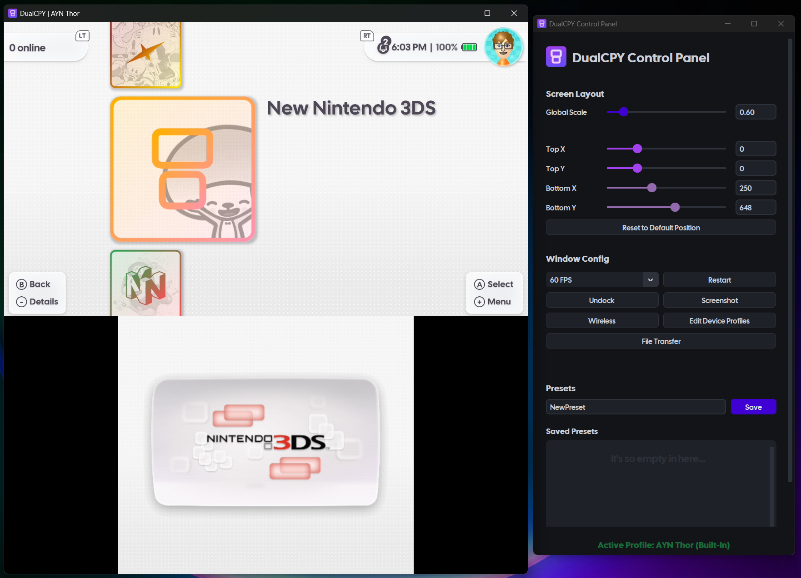
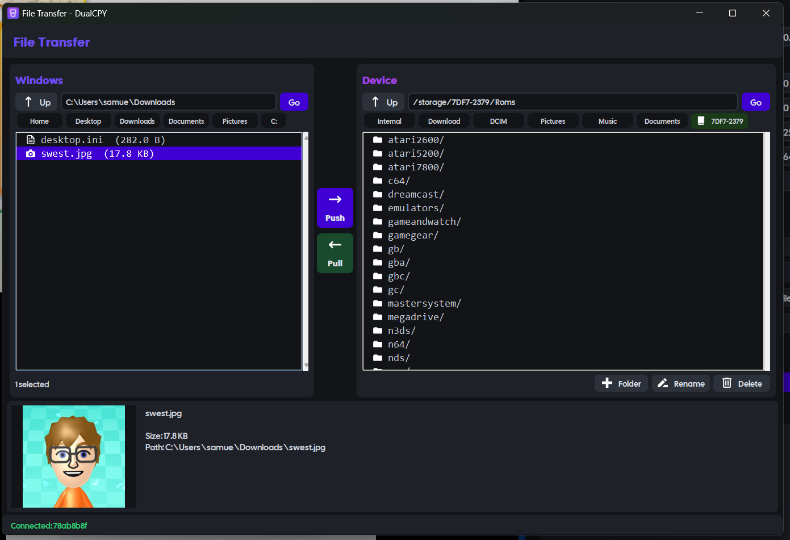
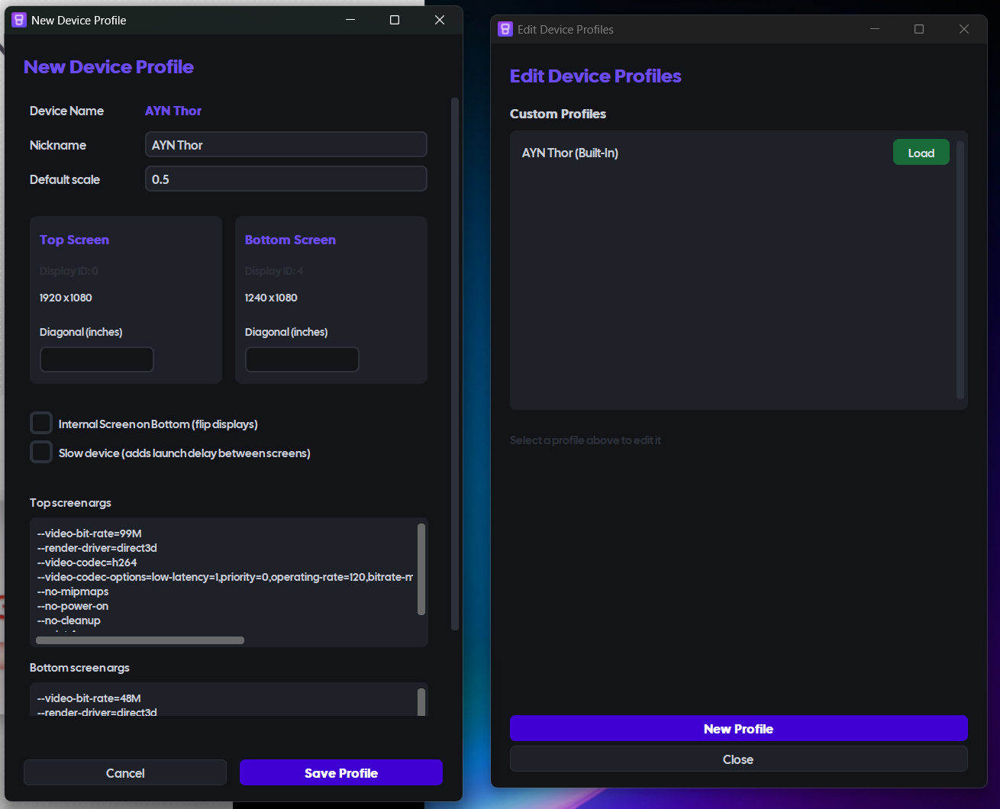

<p align="center">
  
  &nbsp;&nbsp;
  
</p>

> [!NOTE]
> Previously known as **ThorCPY**. As of v1.0.0, the project supports all dual-screen handhelds - not just the AYN Thor - and has been renamed to **DualCPY**.

DualCPY *(pronounced "Dual Copy")* is a Windows-based multi-window scrcpy launcher, designed specifically for dual-screen Android handhelds.
It features a layout editor, window docking, screenshots, file transfer, device profiles, and real-time window positioning.

It launches two scrcpy windows (one for each display) and embeds them into a native Windows container - ideal for screensharing, recording, or livestreaming.

**DualCPY is primarily designed for Windows 11. It will work on Windows 10, however bugs may occur!**

**For Linux users, please use the Linux port: https://github.com/DrSkyfaR/DualCPY-Linux**

Please report any issues at https://github.com/theswest/DualCPY/issues

<h2 align="center">Screenshots</h2>

<table align="center">
  <tr>
    <td align="center"><b>Control Panel</b></td>
    <td align="center"><b>Dual-Screen Capture</b></td>
  </tr>
  <tr>
    <td></td>
    <td></td>
  </tr>
  <tr>
    <td align="center"><b>File Transfer</b></td>
    <td align="center"><b>Device Profiles</b></td>
  </tr>
  <tr>
    <td></td>
    <td></td>
  </tr>
</table>

## What's New in 1.0.0

- Rebranded from ThorCPY to DualCPY, with a brand-new logo and splash screen
- Complete UI redesign in CustomTkinter, with a cleaner, more modern design language
- Multi-device support with automatic device detection and built-in profiles for many handhelds
- Profile editor for custom devices, screen sizes, internal monitors, and per-profile scrcpy commands
- File Transfer window for two-way file management over ADB (@DrSkyfaR & @theswest)
- Gamepad passthrough to the device
- FPS selector and Restart button in the control panel (@tommywaaf)
- Undocked windows now have title bars for easy resizing and moving (@tommywaaf)
- Updated bundled scrcpy to v4.0, plus major backend performance and latency improvements

See the full [CHANGELOG](CHANGELOG.md) for details.

## Features

- Multi-device support with built-in profiles for many dual-screen handhelds (AYN Thor, RG DS, Pocket DS, Retroid/AYN Odin + RDS, Retroid Pocket + RDS, and more), plus custom user-defined profiles
- Automatic device detection over ADB, with a device selector on launch and smart selection of the connected device
- "Last used profile" is remembered per-device and auto-booted on launch
- Both wired (USB) and wireless connection
- Dock both screens into one window, or undock them into independent, resizable, title-barred windows for individual capture (e.g. streaming layouts)
- Layout presets to position the screens precisely how you want
- Screenshot capture grabs both screens together, in the layout you've got them in
- File transfer to and from the device over ADB, with image previews, file metadata, and quick-nav shortcuts on both Windows and device sides
- Profile editor for custom screen sizes, internal-monitor layouts, and per-profile scrcpy launch commands
- Gamepad passthrough to the device (`--gamepad=uhid` on the top screen)
- FPS selector and restart controls in the panel
- Real-time positioning to move the screens into any arrangement

## Installation

> **To use DualCPY, you must have *USB Debugging* enabled.**
> **To enable *USB Debugging*:**
> 1. On the device, go to **Settings > About device**.
> 2. Tap the **Build number** seven times to unlock **Settings > Developer options**.
> 3. Enable the **USB Debugging** option from Developer options.
>
> Then connect your device via USB, or just launch DualCPY to start the wireless connection dialog.

### Option 1: Standalone Executable
- Prebuilt executables can be found in [Releases](https://github.com/theswest/DualCPY/releases).

### Option 2: Run from Source
> Note: Pygame does not yet have a wheel for Python 3.14 - please use a lower version!
1. Clone the repository:
   - `git clone https://github.com/theswest/DualCPY.git`
   - `cd DualCPY`
2. Install Python dependencies:
   - `pip install -r requirements.txt`
3. Run DualCPY:
   - `python main.py`

### Option 3: Build from Source
1. Install PyInstaller:
   - `pip install pyinstaller`
2. Run the build script:
   - `python build.py`
3. Find your build:
   - DualCPY is bundled in `dist/DualCPY/`.

**Note:** scrcpy and ADB binaries are bundled in DualCPY.

## Bundled Software

DualCPY includes the following third-party software:
- **scrcpy v4.0** by Genymobile / Romain Vimont
- Licensed under the Apache License 2.0
- Source: https://github.com/Genymobile/scrcpy

This bundled software is unmodified and used as-is for the convenience of end users.

## Requirements

### System
- OS: Windows 11 (theoretically also Windows 10, 1809+)
- Python 3.8 or higher when running from source
- **Device:** a dual-screen Android handheld with USB debugging enabled

### Python Dependencies
- See [requirements.txt](https://github.com/theswest/DualCPY/blob/master/requirements.txt) for the full list. Install with:
  - `pip install -r requirements.txt`

## Usage

### Connection
- You can connect via USB (charging, offline, more stable) or wirelessly (no tethers).
- To connect via USB:
  - Ensure USB Debugging is enabled (see above).
  - Plug in your device and launch DualCPY!
- To connect wirelessly:
  - Open DualCPY without your device connected via USB.
  - Open the wireless connection menu.
  - In your device's developer settings, enable Wireless debugging and tap the text to open its submenu.
  - Tap Pair device with pairing code and enter the IP address, port, and pairing code shown.
  - Once paired, copy the IP and port from the IP address & Port field into the Connect by IP field in DualCPY.
  - Close the menu - DualCPY will automatically restart and connect!

### Device Selection
- On launch, DualCPY detects connected devices over ADB and shows a device selector.
- It smart-selects the connected device and remembers the last used profile per device.
- Don't see your device? Use the profile editor to add a custom profile (screen sizes, internal-monitor layout, and per-profile scrcpy launch command).

### Main Controls
The DualCPY control panel appears on the right-hand side of your screen with the following controls:
- Global Scale: adjust the scale of the scrcpy outputs (requires restart)
- FPS: select the target framerate
- Restart: restart the mirroring session
- Layout Adjustment:
  - Top X / Top Y: position the top screen
  - Bottom X / Bottom Y: position the bottom screen
- Window Controls:
  - Undock windows: separate into independent, title-barred floating windows (for individual capture, e.g. streaming)
  - Dock windows: bring undocked windows back into one unified window
  - Screenshot: capture the entire docked view to the clipboard (only works when docked)
- File Transfer: open the file browser to move files between your PC and device over ADB
- Preset Management:
  - Adjust your layout as desired
  - Enter a name in the preset field and click SAVE
  - Click LOAD next to a saved preset to apply it
  - Click DEL next to a saved preset to remove it

### File Transfer
- Transfer files in both directions (Windows -> device and device -> Windows) over ADB.
- Delete, rename, and create folders on the device.
- Windows quick-nav: Home, Desktop, Downloads, Documents, Pictures
- Device quick-nav: Internal, Download, DCIM, Pictures, Music, Documents
- Automatic SD card detection with quick-nav pills
- Inline image previews with file metadata

## Configuration

### Layouts / Presets
- Presets are stored in `config/layout.json`. You can edit this file manually if needed:
```json title:layout.json
{
    "Default": {
        "tx": 0,
        "ty": 0,
        "bx": 251,
        "by": 648,
        "global_scale": 0.6
    },
    "Streaming": {
        "tx": 100,
        "ty": 50,
        "bx": 300,
        "by": 700,
        "global_scale": 0.3
    }
}
```

### Config
- General settings are stored in `config/config.json`. You can edit this file manually if needed:
```json title:config.json
{
    "tx": 0,
    "ty": 0,
    "bx": 250,
    "by": 648,
    "global_scale": 0.6,
    "device_profiles": {
        "78ab8b8f": "ayn_thor"
    },
    "last_profile": "AYN Thor",
    "device_scales": {
        "78ab8b8f": 0.6
    }
}
```

### Custom Profiles
- Custom profiles are stored in `config/custom_profiles.json`. You can edit this file manually if needed:

### Logging
- Logs are saved to `logs/` with daily rotation:
  - `dualcpy_YYYYMMDD.log` - main application log
  - `scrcpy_top_YYYYMMDD_HHMMSS.log` - top window scrcpy output
  - `scrcpy_bottom_YYYYMMDD_HHMMSS.log` - bottom window scrcpy output
- To adjust verbosity, change the logging level in `main.py`:
```python title=main.py
logging.basicConfig(
    level=logging.INFO, # Change to DEBUG for detailed logs
    ...
)
```

## Troubleshooting

### Layout issues
- Load a preset at 0.6 global scale and save it.
- Delete `config/layout.json` and `config/config.json` so they are regenerated.

### Device not found
- Ensure USB debugging is enabled on your device - try a different USB cable (a data cable, not charging-only).
- Revoke USB debugging authorizations and reconnect:
  - Settings → System → Developer Options → Revoke USB debugging authorizations
- Check if ADB can see your device: `bin/adb.exe devices`
- Restart the ADB server: `bin/adb.exe kill-server` then `bin/adb.exe start-server`

### scrcpy won't start
- Ensure `scrcpy.exe` is in the `bin/` folder.
- Check the logs for detailed error messages.
- Try running scrcpy manually: `bin/scrcpy.exe -s YOUR_DEVICE_SERIAL`
- Update to the latest scrcpy version.
- Ensure your device exposes the required display IDs for your profile.

### Windows won't dock
- Wait a few seconds for windows to initialize.
- Try toggling dock/undock a few times.
- Restart the application.
- Check the logs for errors.

### Graphical Errors
- Try toggling dock/undock a few times.
- Restart the application.
- Try a wireless connection to rule out USB issues
- Check the logs for errors.

### Performance issues
- Reduce the global scale.
- Lower the FPS in the control panel.
- Close other resource-intensive applications.
- Use a USB 3 port.
- Try increasing the configurable screen-launch delay for lower-powered devices.

### Gamepad not detected
- You may need to reconnect your controller while DualCPY is running - this is an Android limitation with `--gamepad=uhid`.

### Missing DLL or import errors
- Reinstall dependencies: `pip install -r requirements.txt --force-reinstall`
- Ensure Python 3.8+ is installed.
- Install the Visual C++ Redistributables.

### Known Issues
- Restarting does not work when running from source.

## Licenses

- This project is licensed under the GNU General Public License v3.0 - see the LICENSE file [here](https://github.com/theswest/DualCPY/blob/master/bin/LICENSE). You are free to modify and redistribute it under the same terms.
- [scrcpy](https://github.com/Genymobile/scrcpy) uses the Apache License 2.0, found [here](https://github.com/theswest/DualCPY/blob/master/bin/LICENSE_scrcpy.txt).
- The in-app font is [Cal Sans](https://github.com/calcom/font), under the SIL Open Font License 1.1, found [here](https://github.com/theswest/DualCPY/blob/master/assets/fonts/OFL.txt).

## Contributing

Contributions are more than welcome! This started as a personal project but was released after several requests.
Feel free to submit a pull request. For major changes, please open an issue first to discuss what you'd like to change.
This was originally built as a quick personal tool, so refactoring PRs are especially welcome!

## Supporting

Buy me a coffee: https://ko-fi.com/theswest

## Acknowledgements

- **[DrSkyfaR](https://github.com/DrSkyfaR)** - File Transfer logic and the Linux port
- **[tommywaaf](https://github.com/tommywaaf)** - backend performance work, FPS/restart controls, title-barred undocked windows, and more
- **[eldermonkey](https://github.com/eldermonkey)** - for the legacy logo
- **[scrcpy](https://github.com/Genymobile/scrcpy)** by Romain Vimont - the backend
- **[Cal Sans](https://github.com/calcom/font)** by Cal.com Inc. UI typography (SIL Open Font License 1.1)
- **[CustomTkinter](https://github.com/TomSchimansky/CustomTkinter)** - modern UI toolkit
- **Microsoft** - Windows API documentation
- All other contributors and testers, especially dd, splain, and everyone else who helped!
